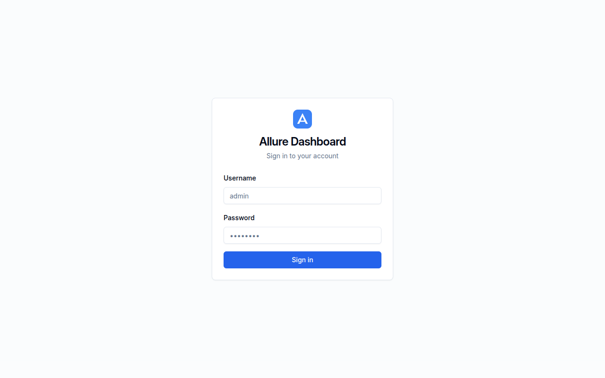
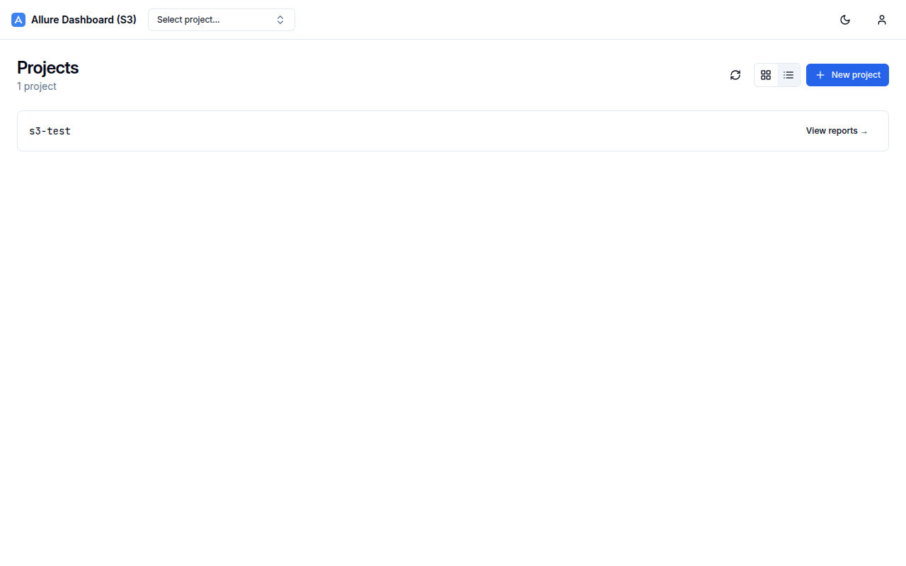
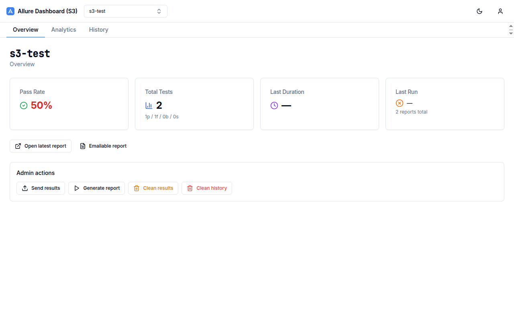
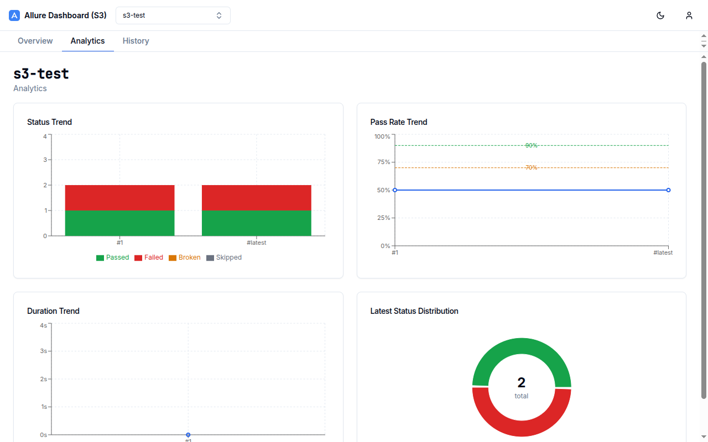
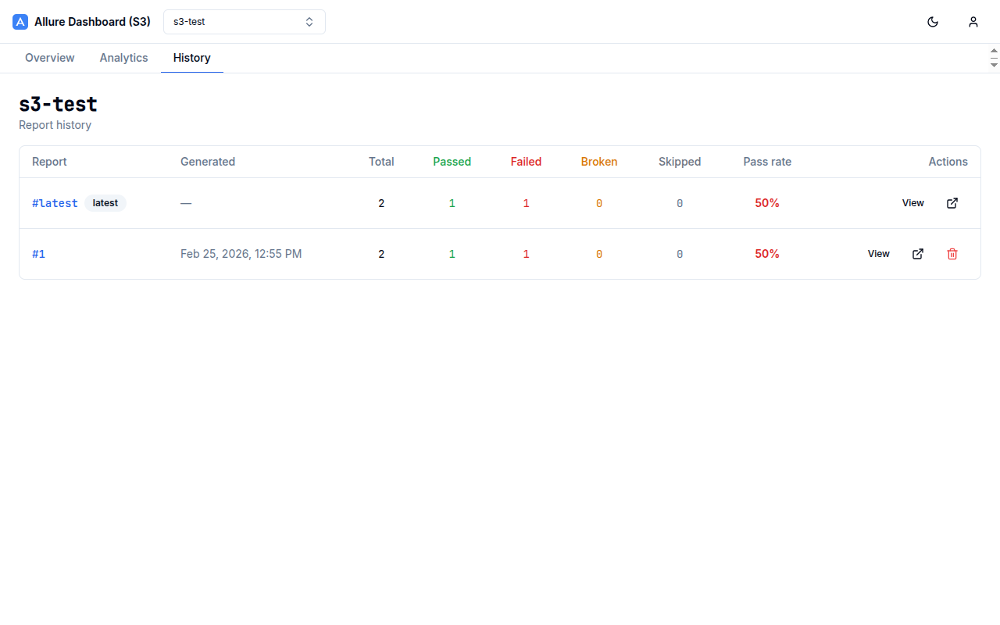
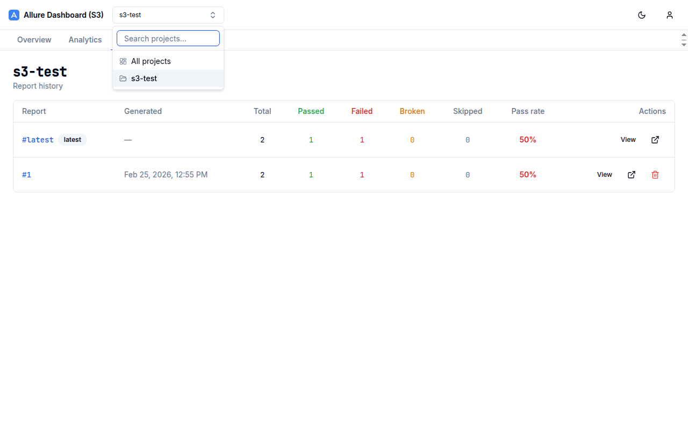
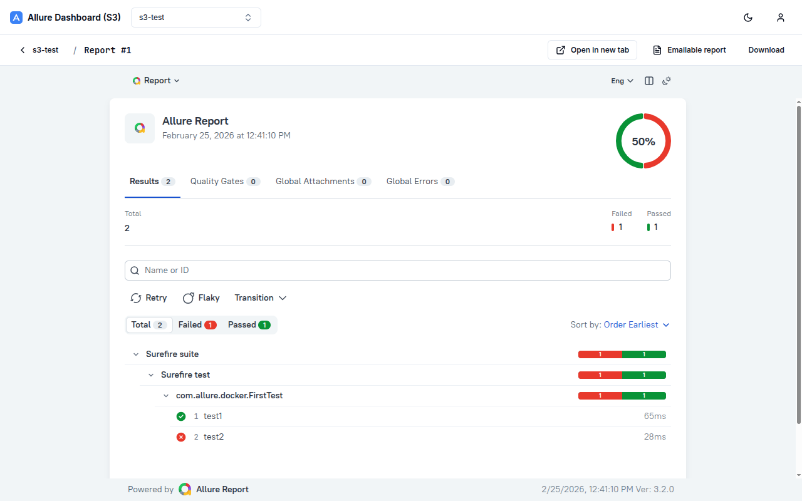
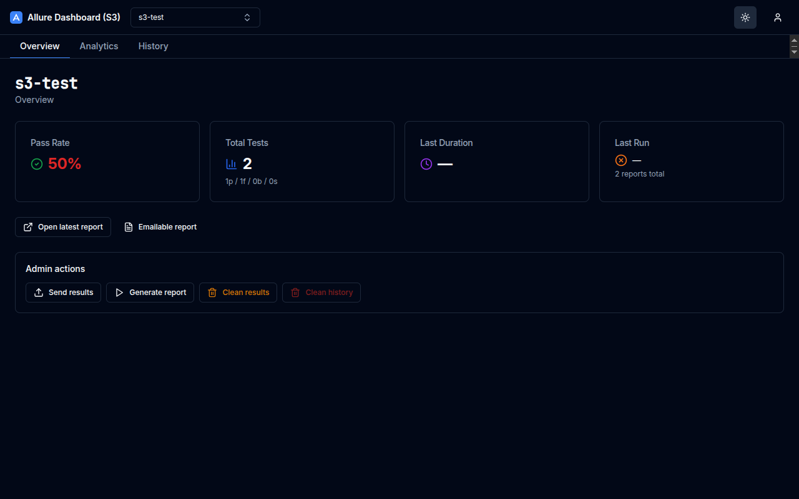
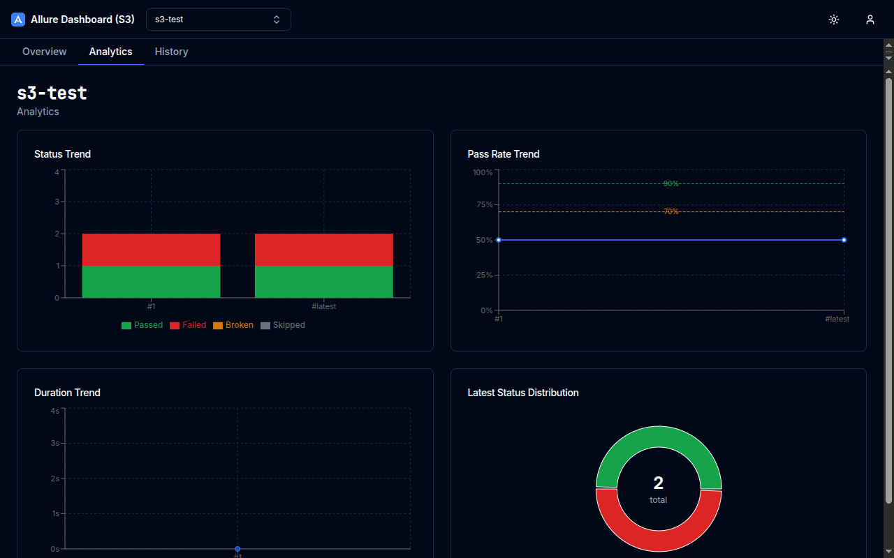
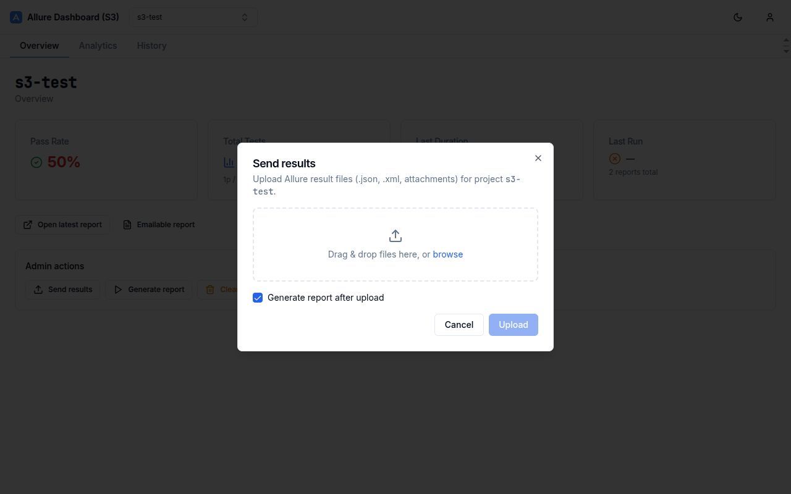

# Allure Dashboard UI

A modern React dashboard for [Allure Docker Service](../allure-docker-service). Provides project management, report browsing, visual analytics, and admin operations via a clean tab-based interface.


## Features

- **Project management** — create, list, delete projects; grid and list view
- **Tab-based navigation** — Overview, Analytics, History tabs per project; tab bar hidden in full-screen report viewer
- **Project selector** — searchable combobox in the top bar for instant project switching
- **Analytics charts** — Status Trend (stacked bar), Pass Rate Trend (line + 90%/70% thresholds), Duration Trend (area), Status Distribution (donut)
- **Report history** — colour-coded table with pass rate, per-build stats, view/delete actions
- **Embedded report viewer** — Allure 2 & 3 reports rendered in an iframe with breadcrumb navigation
- **Admin actions** — send results (drag & drop), generate report, clean results/history
- **Authentication** — JWT-based login; admin vs viewer RBAC
- **Dark / light mode** — system-aware theme toggle
- **Storage backends** — works with both local filesystem and S3/MinIO backends

## Screenshots

| Login | Projects |
|-------|----------|
|  |  |

| Overview (stats + admin actions) | Analytics charts |
|----------------------------------|-----------------|
|  |  |

| Report history table | Project selector |
|----------------------|-----------------|
|  |  |

| Embedded report viewer | Dark mode |
|------------------------|-----------|
|  |  |

| Analytics dark mode | Send results dialog |
|---------------------|---------------------|
|  |  |

## Tech Stack

| Layer | Library |
|-------|---------|
| Framework | React 18 + TypeScript 5 (strict) |
| Routing | React Router v6 |
| Server state | TanStack Query v5 |
| UI state | Zustand |
| UI components | Radix UI + Tailwind CSS (shadcn-style) |
| Charts | Recharts v2 |
| Build | Vite 6 |
| Tests | Vitest + Testing Library |
| Lint/format | ESLint 9 (flat config) + Prettier |

## Quick Start

### With Docker Compose (recommended)

```bash
# Local filesystem backend
docker compose -f docker-compose.yml up --build -d
# Dashboard: http://localhost:7474  API: http://localhost:5050

# S3 / MinIO backend
docker compose -f ../allure-docker-service/docker/docker-compose-s3.yml up -d
# Dashboard: http://localhost:7575  API: http://localhost:5555  MinIO: http://localhost:9001
```

Default credentials: `admin / admin`

### Development

```bash
make install   # install dependencies
make dev       # Vite dev server at http://localhost:5173
make check     # typecheck + lint + test (quality gate)
```

### Environment variables

| Variable | Default | Description |
|----------|---------|-------------|
| `VITE_API_URL` | `http://localhost:5050` | Allure Docker Service base URL |
| `VITE_APP_TITLE` | `Allure Dashboard` | Browser title and top-bar brand |

Variables are injected at **runtime** via `window.__env__` (see `docker/docker-entrypoint.sh`), so a single Docker image works with any API endpoint.

## Project Structure

```
src/
  api/            # axios clients & typed API functions
  components/
    app/          # Layout, TopBar, ProjectSelector, ProjectTabBar
    ui/           # shadcn-style primitives (Button, Card, Dialog…)
  features/
    analytics/    # AnalyticsTab + 4 Recharts components
    auth/         # LoginPage, AuthGuard
    projects/     # ProjectsPage, OverviewTab, ProjectCard, dialogs
    reports/      # HistoryTab, ReportViewerPage, SendResultsDialog…
  lib/            # chart-utils, formatters, cn helper
  routes/         # React Router route tree
  store/          # Zustand stores (auth, ui)
  types/          # shared API types
```

## Make targets

```
make install       install dependencies (npm ci)
make dev           Vite dev server
make build         production build → dist/
make check         typecheck + lint + test
make test          run tests once
make docker-build  build Docker image
make docker-up     start full stack
make docker-down   stop stack
```

## Docker image

The image is a two-stage build: Node 20 Alpine builds the assets, nginx 1.27 Alpine serves them. A custom entrypoint writes runtime env vars into `window.__env__` before nginx starts, keeping the image portable across environments.

```bash
docker build -f docker/Dockerfile -t allure-dashboard-ui:dev .
```
