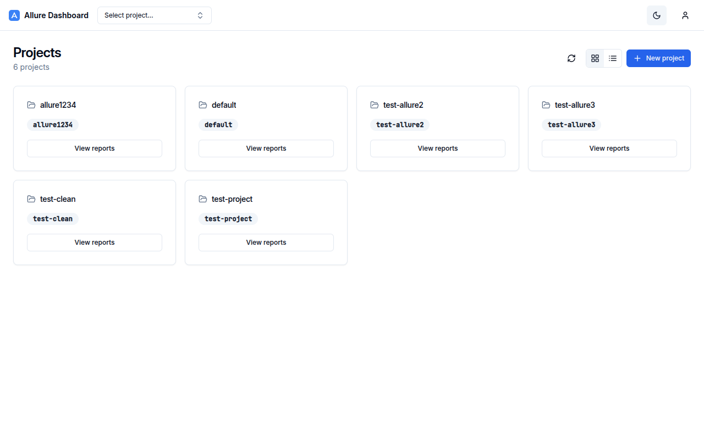

# AllureDeck

A modern dashboard for Allure test reports — Go API backend + React frontend.

Rewrite of [ [fescobar/allure-docker-service](https://github.com/fescobar/allure-docker-service) | [fescobar/allure-docker-service-ui](https://github.com/fescobar/allure-docker-service-ui) ].



## Features

- **Project management** — create, list, delete projects; grid and list view
- **Tab-based navigation** — Overview, Analytics, History tabs per project
- **Analytics charts** — Status Trend, Pass Rate Trend, Duration Trend, Status Distribution
- **Report history** — colour-coded table with pass rate, per-build stats, view/delete actions
- **Embedded report viewer** — Allure 2 & 3 reports rendered in an iframe
- **Admin actions** — send results (drag & drop), generate report, clean results/history
- **Authentication** — JWT-based login; admin vs viewer RBAC
- **Dark / light mode** — system-aware theme toggle
- **Storage backends** — local filesystem and S3/MinIO

## Quick Start

### With Docker Compose (recommended)

```bash
# Full stack (UI + API)
docker compose -f docker/docker-compose.yml up --build -d
# Dashboard: http://localhost:7474  API: http://localhost:5050

# Full stack with S3 / MinIO
docker compose -f docker/docker-compose-s3.yml up -d
# Dashboard: http://localhost:7474  API: http://localhost:5050  MinIO: http://localhost:9001

# API-only (dev)
docker compose -f docker/docker-compose-dev.yml up --build -d
```

Default credentials: `admin / admin`

### Development

```bash
# API (Go)
make api-test      # run tests
make api-check     # fmt + vet + lint + test
make api-run       # build and run locally

# UI (React)
make ui-install    # install dependencies
make ui-dev        # Vite dev server at http://localhost:5173
make ui-check      # typecheck + lint + test

# Full quality gate
make check         # API + UI checks
```

### Environment variables

| Variable | Default | Description |
|----------|---------|-------------|
| `VITE_API_URL` | `http://localhost:5050` | AllureDeck API base URL |
| `VITE_APP_TITLE` | `AllureDeck` | Browser title and top-bar brand |

Variables are injected at **runtime** via `window.__env__` (see `docker/docker-entrypoint.sh`), so a single Docker image works with any API endpoint.

## Project Structure

```
alluredeck/
  api/              # Go HTTP API backend
    cmd/api/        # entry point
    internal/       # config, handlers, middleware, runner, security, store, storage
    static/         # embedded static assets + swagger UI
    go.mod
  ui/               # React + TypeScript frontend
    src/
      api/          # axios clients & typed API functions
      components/   # shared UI components (shadcn-style)
      features/     # feature-scoped components and logic
      routes/       # React Router route tree
      store/        # Zustand stores
    package.json
  docker/           # Dockerfiles and compose configs
    Dockerfile.api
    Dockerfile.ui
    docker-compose.yml
    docker-compose-dev.yml
    docker-compose-s3.yml
  Makefile          # unified build orchestration
```

## Make targets

Run `make help` for a full list. Key targets:

```
make api-check        API quality gate (fmt + vet + lint + test)
make ui-check         UI quality gate (typecheck + lint + test)
make check            full quality gate (API + UI)
make docker-build     build both Docker images
make docker-up        start full stack (UI + API)
make docker-down      stop full stack
```
