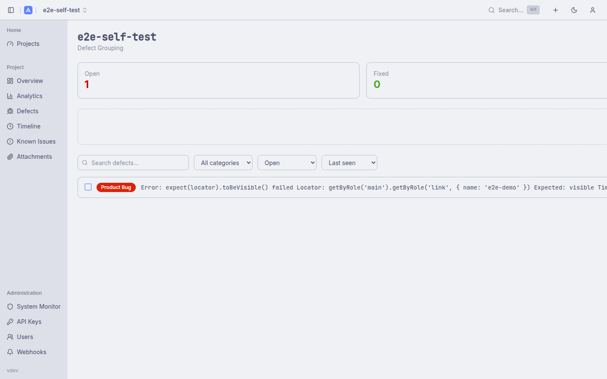
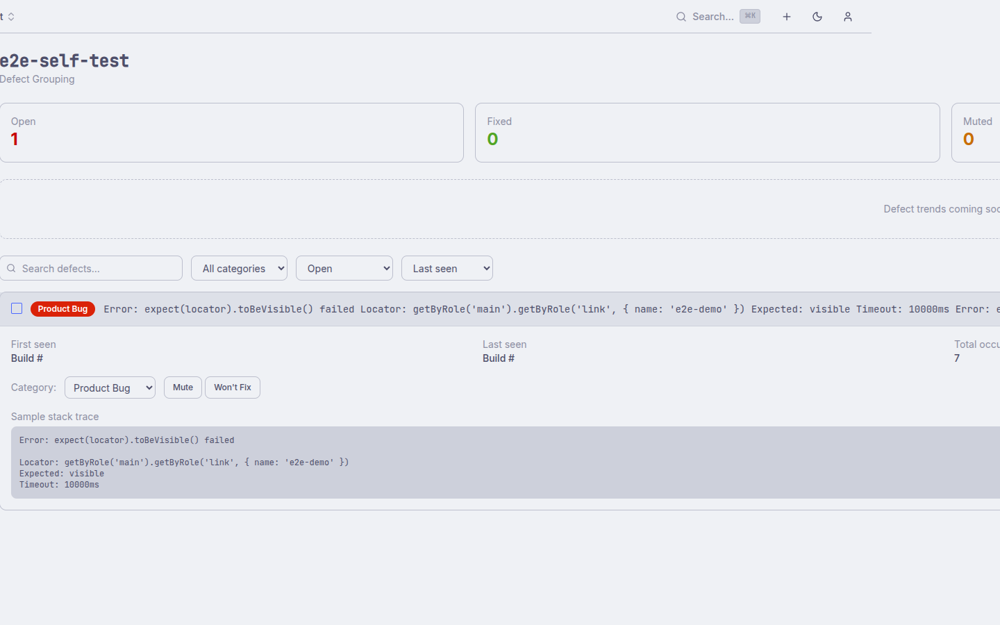

# Defects

The Defects subsystem groups repeat test failures by **error fingerprint**, giving you a single tracked item for each distinct root cause instead of a separate entry for every failing test. This separates failure triage (Defects) from test tagging (Known Issues).

Related documentation: [Features](features.md) · [Known Issues](features.md#known-issues)

---

## Table of Contents

1. [How Fingerprinting Works](#how-fingerprinting-works)
2. [Defects vs Known Issues](#defects-vs-known-issues)
3. [Defect Metadata](#defect-metadata)
4. [Project-Level View](#project-level-view)
5. [Build-Level View](#build-level-view)
6. [Defect Detail](#defect-detail)
7. [Bulk Actions](#bulk-actions)
8. [API Reference](#api-reference)

---

## How Fingerprinting Works

When a report is generated, AllureDeck's runner normalises each failing test's error message and stack trace, then hashes the result to produce a fingerprint. Normalisation strips volatile tokens — timestamps, memory addresses, line numbers that shift between builds — so the same logical failure produces the same fingerprint across builds even when minor formatting changes occur.

Tests with the same fingerprint are grouped into a single Defect record. The first time a fingerprint appears, a Defect is created automatically. Subsequent occurrences increment its `occurrence_count` and update its `last_seen_build`. If several builds pass cleanly after a defect appeared, the `consecutive_clean_builds` counter increments; when this drops back to zero on the next failure, the defect is flagged as a **regression**.

Defects are created and updated entirely server-side during report generation — no manual creation is needed.

---

## Defects vs Known Issues

| | Defects | Known Issues |
|---|---------|--------------|
| **Scope** | Error fingerprints (cluster of tests with the same root cause) | Individual test names or regex patterns |
| **Created by** | Automatically by the runner | Manually by an editor |
| **Purpose** | Failure triage and regression detection | Adjusted pass rate, marking known-bad tests |
| **Linked** | A Defect can link to a Known Issue for cross-reference | A Known Issue can reference a Defect |

---

## Defect Metadata

Each defect record carries:

| Field | Description |
|-------|-------------|
| **Fingerprint** | SHA-256 of the normalised error + stack trace |
| **Error message** | Normalised (volatile tokens removed) representative error |
| **Category** | Classification of the root cause |
| **Resolution** | Current disposition |
| **First seen build** | Build number where this fingerprint first appeared |
| **Last seen build** | Most recent build where the fingerprint appeared |
| **Occurrence count** | Total number of times the fingerprint has been observed |
| **Consecutive clean builds** | Builds since the last occurrence (used for regression detection) |
| **Known Issue link** | Optional reference to a Known Issue record |

**Categories:**

| Value | Label |
|-------|-------|
| `product_bug` | Product Bug |
| `test_bug` | Test Bug |
| `infrastructure` | Infrastructure |
| `to_investigate` | To Investigate |

**Resolutions:**

| Value | Label |
|-------|-------|
| `open` | Open |
| `fixed` | Fixed |
| `muted` | Muted |
| `won't fix` | Won't Fix |

---

## Project-Level View

Navigate to a project and click **Defects** in the sidebar (available for non-parent projects). The view is at `/projects/{id}/defects`.

**Summary cards at the top:**

| Card | Description |
|------|-------------|
| Open | Defects with resolution `open` |
| Fixed | Defects with resolution `fixed` |
| Muted | Defects with resolution `muted` |
| Regressions | Defects that were fixed or muted but reappeared |

A trend chart below the cards shows defect counts per build over time.

**Table columns:** category badge, normalised error message, affected test count, first seen / last seen build, and flags for new / regression status.

**Filters (above the table):**

- Text search on the normalised error message
- Category dropdown (All / Product Bug / Test Bug / Infrastructure / To Investigate)
- Resolution dropdown (All / Open / Fixed / Muted / Won't Fix)
- Sort by: last seen (default), first seen, or occurrence count

---

## Build-Level View

Accessible from the Report History table: click the build row's action menu and select "Defects", or navigate to `/projects/{id}/builds/{build_id}/defects`.

This view shows only the defects observed in a specific build, with summary badges for **Groups**, **Affected tests**, **New**, and **Regressions**.

---

## Defect Detail

Click any defect row to expand an inline drawer showing:

- Metadata grid: first seen, last seen, total occurrences, consecutive clean builds
- Full normalised error message
- **Category selector** — change the category (editor+)
- **Resolution action buttons**: Mute, Won't Fix, Reopen (editor+)
- **Known Issue link** — associate this defect with a Known Issue record

---

## Bulk Actions

Check multiple rows to reveal the bulk action toolbar. Available actions:

- **Set category** — apply a category to all selected defects in one API call
- **Set resolution** — apply a resolution to all selected defects in one API call

Bulk operations call `POST /api/v1/projects/{project_id}/defects/bulk` with an array of defect IDs and the new values.

---

## API Reference

| Method | Path | Description |
|--------|------|-------------|
| `GET` | `/api/v1/projects/{project_id}/defects` | Paginated project-wide defect list. Query params: `search`, `category`, `resolution`, `sort`, `page`, `per_page` |
| `GET` | `/api/v1/projects/{project_id}/defects/summary` | Open / fixed / muted / regression counts and category breakdown |
| `GET` | `/api/v1/projects/{project_id}/defects/{defect_id}` | Single defect metadata |
| `GET` | `/api/v1/projects/{project_id}/defects/{defect_id}/tests` | Tests currently attached to this defect |
| `PATCH` | `/api/v1/projects/{project_id}/defects/{defect_id}` | Update category, resolution, or known-issue link (editor+). Body: `{"category":"product_bug","resolution":"muted"}` |
| `POST` | `/api/v1/projects/{project_id}/defects/bulk` | Bulk-update category / resolution on many defects (editor+). Body: `{"ids":[1,2,3],"category":"test_bug"}` |
| `GET` | `/api/v1/projects/{project_id}/builds/{build_id}/defects` | Defects observed in a specific build |
| `GET` | `/api/v1/projects/{project_id}/builds/{build_id}/defects/summary` | Build-scoped summary counts |
