# AllureDeck Features

AllureDeck is a self-hosted dashboard for Allure test reports. It provides a Go API backend and React frontend for managing projects, browsing report history, visualising test analytics, and embedding Allure 2 and 3 reports inline.

Related documentation: [Deployment & Security](deployment.md) · [Configuration Reference](configuration.md) · [Storage](storage.md) · [Development Guide](development.md)

---

## Table of Contents

1. [Authentication & Access Control](#authentication--access-control)
2. [Projects Dashboard](#projects-dashboard)
3. [Project Management](#project-management)
4. [Project Overview](#project-overview)
   - [Report History](#report-history)
5. [Analytics](#analytics)
6. [Known Issues](#known-issues)
7. [Test Execution Timeline](#test-execution-timeline)
8. [Build Comparison](#build-comparison)
9. [Report Viewer](#report-viewer)
10. [Report Operations (Admin)](#report-operations-admin)
11. [Global Search](#global-search)
12. [Admin System Monitor](#admin-system-monitor)
13. [Navigation & UI](#navigation--ui)
14. [Backend & Deployment](#backend--deployment)
15. [CI/CD Integration](#cicd-integration)
16. [Configuration Quick Reference](#configuration-quick-reference)

---

## Authentication & Access Control

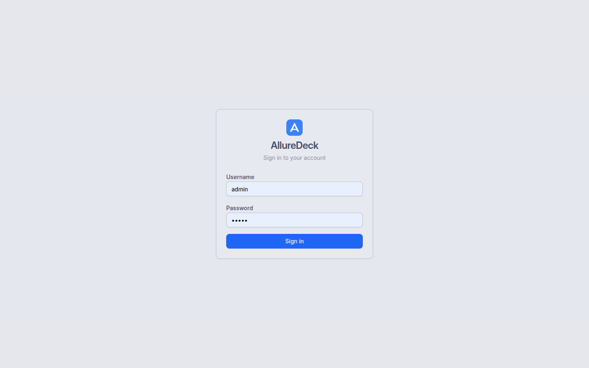

AllureDeck uses JWT-based authentication with CSRF protection and per-IP rate limiting on the login endpoint.

**Roles:**

| Role    | Capabilities |
|---------|-------------|
| `admin` | Full access: create/delete projects, upload results, generate/clean reports, manage known issues, access System Monitor |
| `viewer` | Read-only: browse projects, view reports, view analytics, view known issues |

**Configuration:**

| Environment Variable | Description | Default |
|---------------------|-------------|---------|
| `ADMIN_USERNAME` | Admin account username | `admin` |
| `ADMIN_PASSWORD` | Admin account password (bcrypt) | `admin` |
| `VIEWER_USERNAME` | Viewer account username | `viewer` |
| `VIEWER_PASSWORD` | Viewer account password | `viewer` |
| `JWT_SECRET` | Secret for signing JWT tokens | auto-generated |
| `JWT_EXPIRY` | Token lifetime | `24h` |

> **Important:** Change default credentials before exposing AllureDeck to any network. See [Deployment & Security](deployment.md) for production hardening.

**Public viewer mode:** Set `PUBLIC_MODE=true` to allow unauthenticated read-only access.

---

## Projects Dashboard

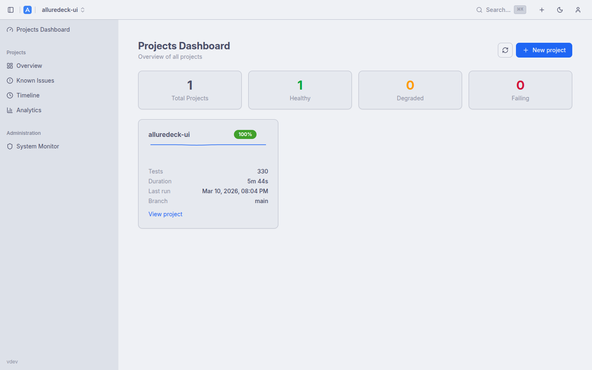

The dashboard is the landing page after login. It provides a cross-project health summary at a glance.

**Health summary cards:**
- **Total Projects** — count of all registered projects
- **Healthy** — projects with the latest build at 100% pass rate (green)
- **Degraded** — projects with pass rate between 70-99% (orange)
- **Failing** — projects with pass rate below 70% (red)

**Project cards** each show:
- Project name and latest pass rate badge
- Sparkline chart of recent pass rates
- Test count, duration, last run time, and latest branch
- "View project" link

---

## Project Management

Projects are the top-level organisational unit. Each project has a unique slug (e.g. `my-service`) used in API calls.

**Create a project:** Click "+ New project" on the dashboard or use the "Create new" (+) button in the top navigation bar.

**Delete a project:** Open the project card's action menu (three-dot button) and select "Delete project". This removes the project record and all associated reports from storage.

**Tag management:** Open the project card's action menu and select "Edit tags" to assign free-form labels. Tags can be used for filtering on the dashboard.

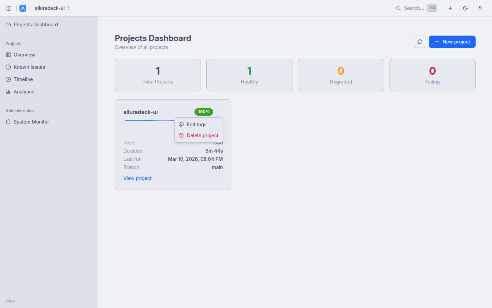

**Views:** The dashboard supports grid and list views. Toggle between them using the view switcher in the top-right of the dashboard.

---

## Project Overview

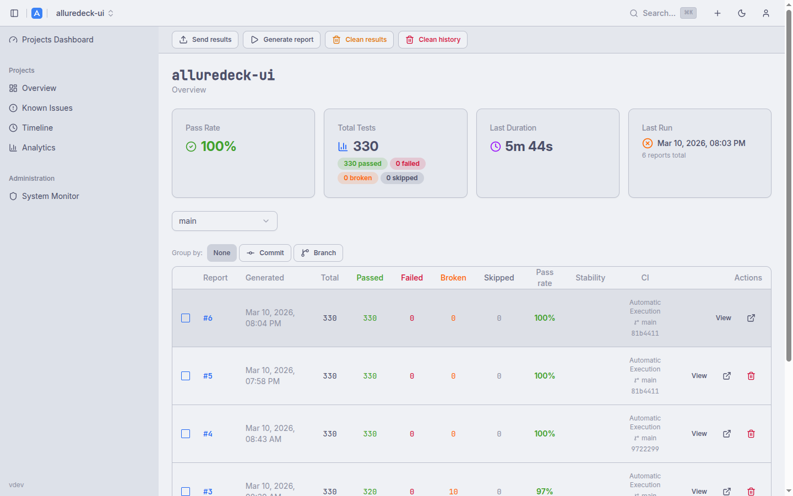

Clicking a project opens its Overview page, which provides a summary of the latest test run:

**Stat cards:**
- **Pass Rate** — percentage of passing tests in the latest report
- **Total Tests** — total test count with passed / failed / broken / skipped breakdown
- **Last Duration** — total execution time of the latest run
- **Last Run** — timestamp of the latest report and total report count

**Branch filter:** A dropdown above the report table lets you filter history by branch. All known branches are listed.

**Group by:** Buttons to group the report history table by None, Commit SHA, or Branch.

### Report History


The paginated report history table shows all generated reports for the selected branch, most recent first.

**Columns:**
- **Report** — report number (links to the embedded report viewer)
- **Generated** — timestamp of report generation
- **Total / Passed / Failed / Broken / Skipped** — test counts per status
- **Pass rate** — colour-coded: green ≥ 90%, orange 70-89%, red < 70%
- **Stability** — percentage of builds where this report's tests passed
- **CI** — execution context: trigger name, branch, and commit SHA
- **Actions** — View (embedded), open in new tab, delete

**Build selection for comparison:** Check two reports in the table to reveal a "Compare" button that links directly to the [Build Comparison](#build-comparison) view.

---

## Analytics

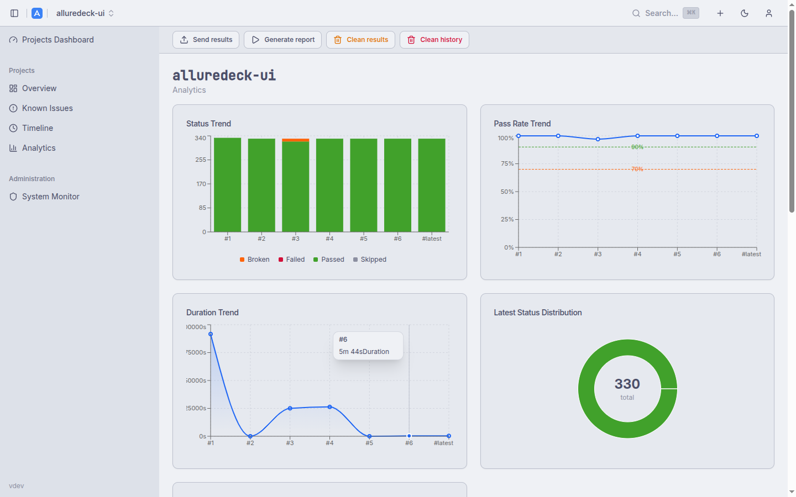

The Analytics page surfaces nine chart types for understanding test suite trends across builds.

**Trend charts (upper section):**
- **Status Trend** — stacked bar chart of passed / failed / broken / skipped counts per build
- **Pass Rate Trend** — line chart of pass rate over time with 90% (good) and 70% (warning) threshold lines
- **Duration Trend** — line chart of total test suite duration per build
- **Latest Status Distribution** — donut chart of test result breakdown for the most recent build


**Detail charts (lower section):**
- **Failure Categories** — categorised breakdown of failure reasons (from Allure categories.json)
- **Low Performing Tests** — table of the slowest and least-reliable tests with average duration, build count, and sparkline trend; toggle between "Slowest" and "Least reliable" views

---

## Known Issues

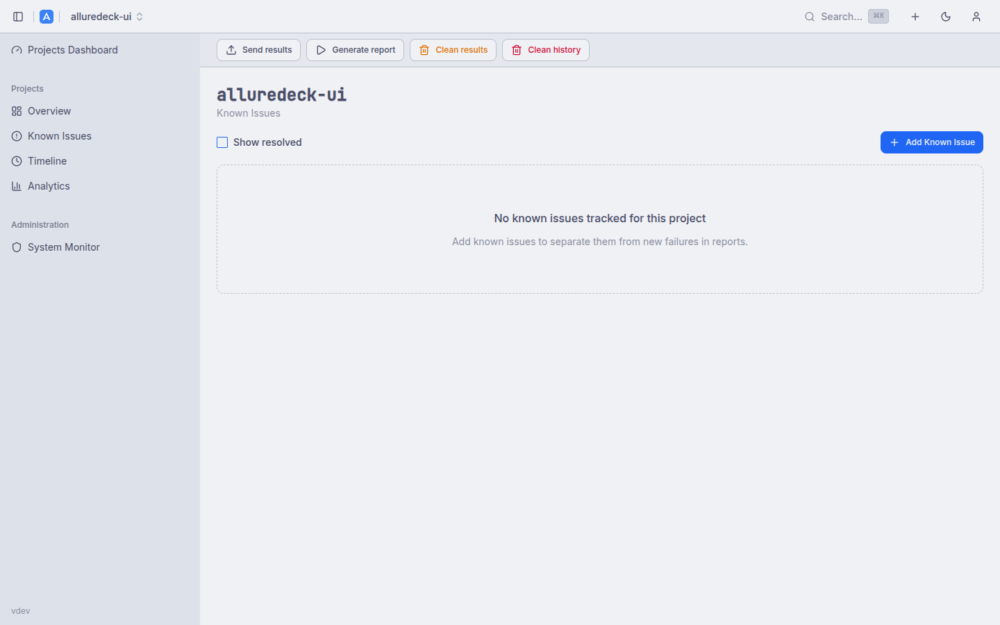

Known Issues lets you tag test cases that are currently broken by design — flaky tests, tests blocked by a known bug, or tests pending a fix.

**Features:**
- **Create / edit / resolve** known issues with a name, description, and optional ticket URL
- **Pattern matching** — associate a known issue with test names matching a regex or substring
- **Adjusted pass rate** — the Overview and Dashboard pass rate calculations exclude tests matched by active known issues, giving a cleaner signal
- **Show resolved** toggle — view resolved issues alongside active ones
- "+ Add Known Issue" button available to admin users

---

## Test Execution Timeline

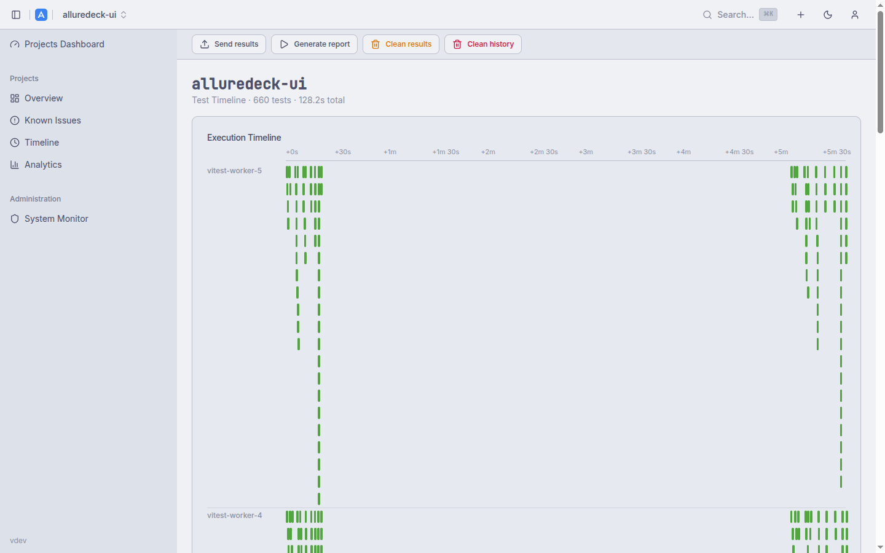

The Timeline page renders a Gantt-style chart of the latest test run, visualising how tests were distributed across parallel workers.

**Features:**
- **Swim lanes** — one row per test worker / thread (e.g. `vitest-worker-0`, `vitest-worker-1`)
- **Time axis** — horizontal axis shows elapsed time from the start of the run
- **Colour coding** — bars are coloured by test status: green (passed), red (failed), orange (broken), grey (skipped)
- **Summary** — header shows total test count and total wall-clock duration

This view is especially useful for identifying bottlenecks in parallel test suites or workers that are significantly under-utilised.

---

## Build Comparison

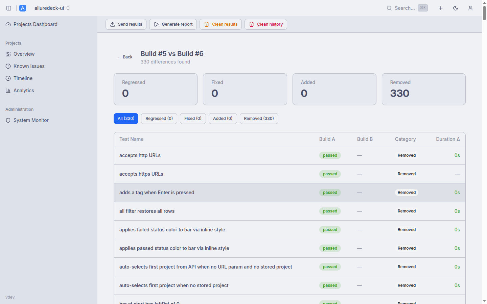

Select two builds from the Report History table and click "Compare" to open the diff view.

**Summary cards:**
- **Regressed** — tests that passed in Build A but failed/broken in Build B
- **Fixed** — tests that failed/broken in Build A but passed in Build B
- **Added** — tests present in Build B but not in Build A
- **Removed** — tests present in Build A but not in Build B

**Filter tabs:** Click any category card to filter the table to that subset. The "All" tab shows everything.

**Table columns:** Test Name, Build A status, Build B status, Category (Regressed / Fixed / Added / Removed), Duration delta.

---

## Report Viewer

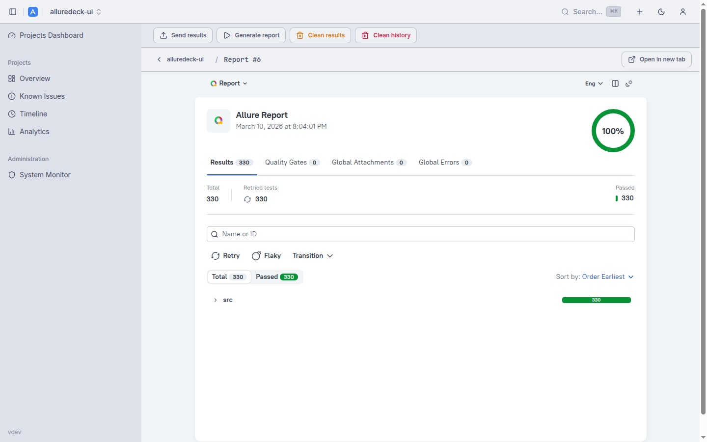

AllureDeck embeds Allure reports directly in the dashboard via an iframe, with a breadcrumb navigation bar at the top.

**Features:**
- Supports both **Allure 2** and **Allure 3** report formats
- **Breadcrumb** — `project-name / Report #N` with a back link
- **Open in new tab** — button to open the raw Allure report in a standalone browser tab
- **Split view** icon to toggle sidebar/main layout
- The embedded report includes all standard Allure features: test results tree, quality gates, global attachments, global errors, retries, flaky test indicators

---

## Report Operations (Admin)

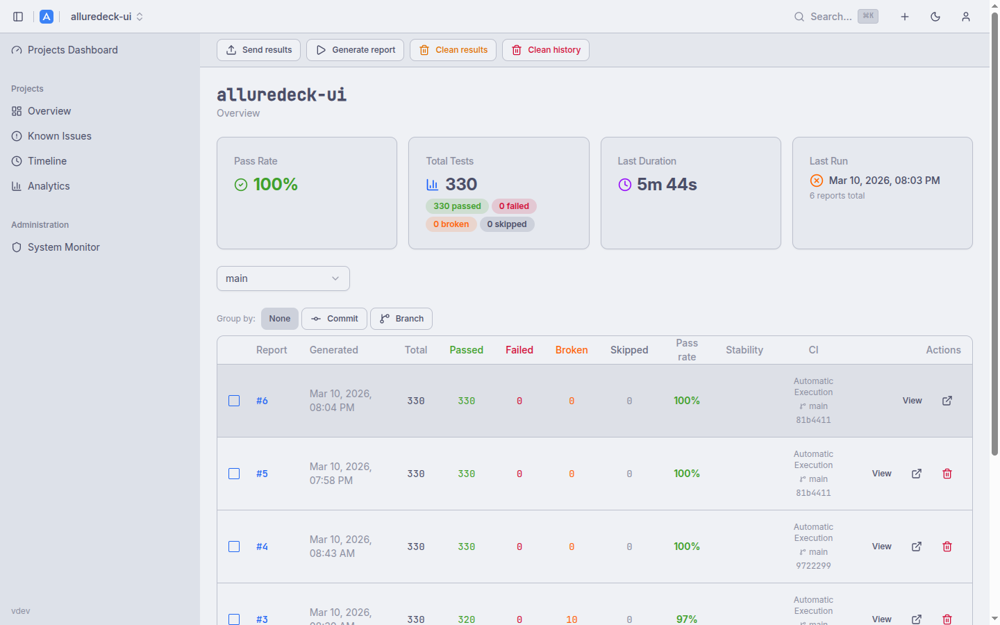

Admin users see an action bar at the top of every project page with four operations:

| Button | Action |
|--------|--------|
| **Send results** | Upload Allure result files (.json, .xml, attachments) via drag & drop |
| **Generate report** | Trigger report generation from the current results directory |
| **Clean results** | Delete all pending result files for this project |
| **Clean history** | Delete all generated reports and report history for this project |

### Send Results Dialog

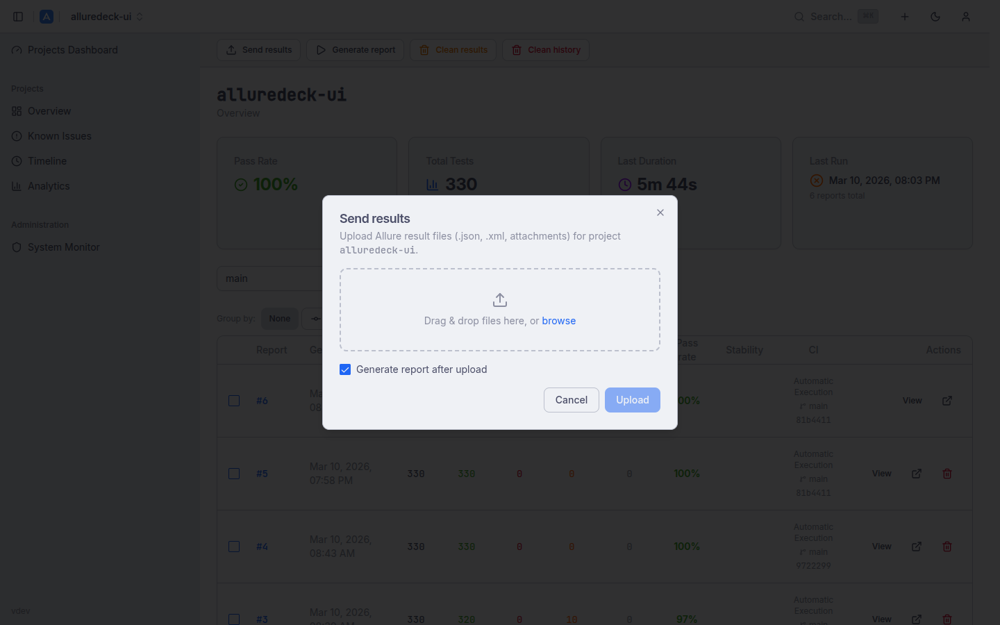

Clicking "Send results" opens a modal with a drag-and-drop drop zone. You can also browse for files. The "Generate report after upload" checkbox (on by default) will automatically trigger report generation after the upload completes.

### curl examples for CI/CD

Upload results and generate a report in one step:

```bash
# Upload results
curl -X POST http://localhost:5050/api/v1/projects/my-project/results \
  -H "Authorization: Bearer $TOKEN" \
  -F "files[]=@allure-results/result1-result.json" \
  -F "files[]=@allure-results/result2-result.json"

# Generate report
curl -X GET http://localhost:5050/api/v1/projects/my-project/reports/generate \
  -H "Authorization: Bearer $TOKEN"
```

Get a token first:

```bash
TOKEN=$(curl -s -X POST http://localhost:5050/api/v1/auth/login \
  -H "Content-Type: application/json" \
  -d '{"username":"admin","password":"admin"}' | jq -r .token)
```

---

## Global Search

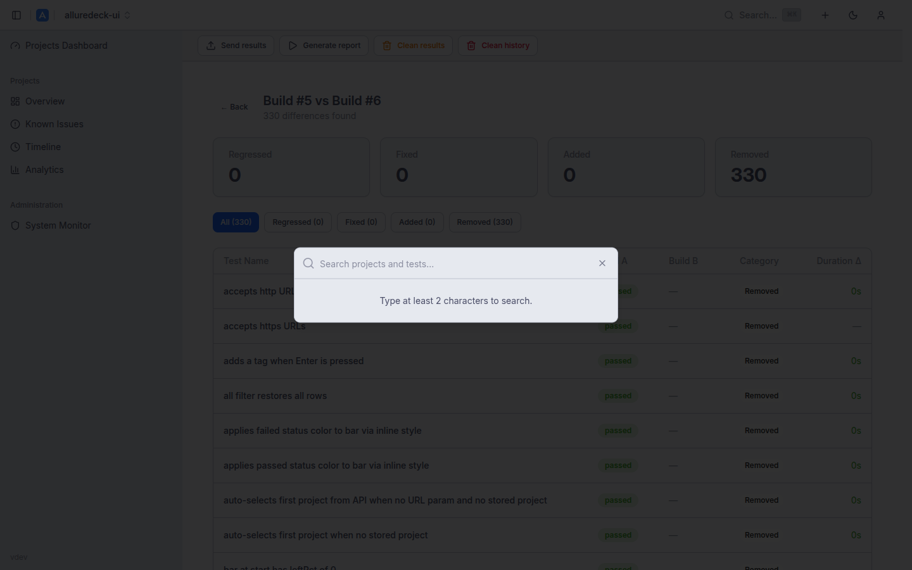

Press **Cmd+K** (macOS) or **Ctrl+K** (Linux/Windows) to open the global search palette from anywhere in the app.

**Searches across:**
- Project names
- Test names within the current project

Type at least 2 characters to trigger results. Results are grouped by type and navigable with arrow keys. Press Enter to navigate or Escape to close.

---

## Admin System Monitor

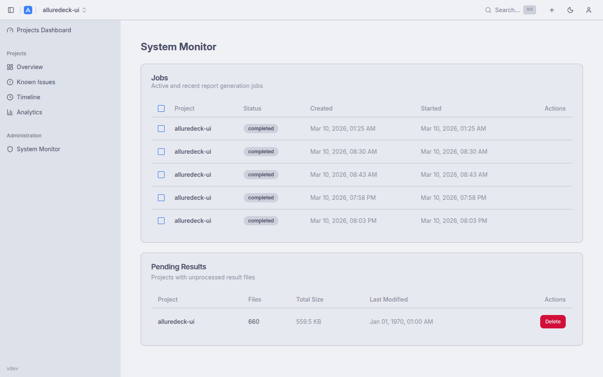

Accessible via "System Monitor" in the sidebar (admin only), this page provides operational visibility into background job activity.

**Jobs table:**
- Lists active and recently completed report generation jobs
- Columns: Project, Status (pending / running / completed / failed), Created, Started
- Bulk selection with checkbox for delete operations

**Pending Results table:**
- Lists projects that have uploaded result files awaiting report generation
- Columns: Project, Files count, Total size, Last Modified
- "Delete" action to discard pending results without generating a report

---

## Navigation & UI

**Sidebar:** The collapsible left sidebar shows the current project's navigation (Overview, Known Issues, Timeline, Analytics) and the Administration section (System Monitor). Collapse it with the toggle button to maximise the main content area.

**Project switcher:** The project name button in the top navigation bar opens a dropdown to switch between projects without returning to the dashboard.

**Theme toggle:** The moon/sun icon in the top navigation bar switches between light and dark mode. The preference is persisted in local storage.

**Branch management:** The branch selector dropdown on the Project Overview page filters all history and stats to the selected branch.

---

## Backend & Deployment

**Storage backends:**

| Backend | Configuration | Use case |
|---------|---------------|----------|
| Local filesystem | `STORAGE_TYPE=local` | Single-node deployments, development |
| S3 / MinIO | `STORAGE_TYPE=s3` | Multi-node, cloud, or high-availability setups |

**Background watcher:** AllureDeck includes a background watcher that polls for new result files and auto-generates reports based on the `AUTO_GENERATE` configuration. See [Configuration Reference](configuration.md).

**Docker Compose variants:**

| File | Purpose |
|------|---------|
| `docker/docker-compose.yml` | Standard deployment (local storage, PostgreSQL) |
| `docker/docker-compose-dev.yml` | API-only development stack |
| `docker/docker-compose-s3.yml` | Full stack with MinIO S3-compatible storage |

**Helm chart:** A production-ready Helm chart is published to `oci://ghcr.io/mkutlak/charts/alluredeck`. See [Helm Chart Reference](../charts/alluredeck/README.md) for full configuration including PostgreSQL setup, IRSA on EKS, and all `values.yaml` options.

**Allure version support:** AllureDeck parses and serves both Allure 2 and Allure 3 report formats. The format is detected automatically per project.

**Swagger API docs:** Available at `/swagger/index.html` when `SWAGGER_ENABLED=true`.

**Multi-arch images:** Docker images are published for `linux/amd64` and `linux/arm64`.

---

## CI/CD Integration

AllureDeck is designed to integrate into any CI/CD pipeline via its REST API.

**Typical GitHub Actions workflow:**

```yaml
- name: Upload Allure results
  if: always()
  run: |
    TOKEN=$(curl -s -X POST ${{ secrets.ALLUREDECK_URL }}/api/v1/auth/login \
      -H "Content-Type: application/json" \
      -d '{"username":"${{ secrets.ALLUREDECK_USER }}","password":"${{ secrets.ALLUREDECK_PASS }}"}' \
      | jq -r .token)

    find allure-results -type f | while read f; do
      curl -s -X POST ${{ secrets.ALLUREDECK_URL }}/api/v1/projects/${{ github.event.repository.name }}/results \
        -H "Authorization: Bearer $TOKEN" \
        -F "files[]=@$f"
    done

    curl -s -X GET ${{ secrets.ALLUREDECK_URL }}/api/v1/projects/${{ github.event.repository.name }}/reports/generate \
      -H "Authorization: Bearer $TOKEN"
```

**Auto-generation:** Set `AUTO_GENERATE_REPORT=true` on the API to automatically generate reports whenever new results are uploaded, removing the need to call the generate endpoint explicitly.

**CI metadata:** Include `executorInfo.json` in your results to populate the CI column (executor name, branch, commit SHA) in the report history table.

---

## Configuration Quick Reference

| Variable | Description | Default |
|----------|-------------|---------|
| `HTTP_PORT` | API server port | `5050` |
| `STORAGE_TYPE` | `local` or `s3` | `local` |
| `PROJECTS_DIR` | Root directory for local project storage | `./projects` |
| `DATABASE_URL` | PostgreSQL connection string | required |
| `ADMIN_USERNAME` | Admin username | `admin` |
| `ADMIN_PASSWORD` | Admin password | `admin` |
| `JWT_SECRET` | JWT signing secret | auto-generated |
| `AUTO_GENERATE_REPORT` | Auto-generate on upload | `false` |
| `SWAGGER_ENABLED` | Enable Swagger UI | `false` |
| `PUBLIC_MODE` | Allow unauthenticated read access | `false` |
| `LOG_LEVEL` | `debug`, `info`, `warn`, `error` | `info` |

See [Configuration Reference](configuration.md) for the complete list including S3, TLS, CORS, rate limiting, and Go memory settings.
