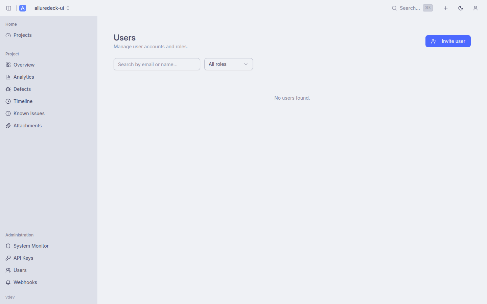
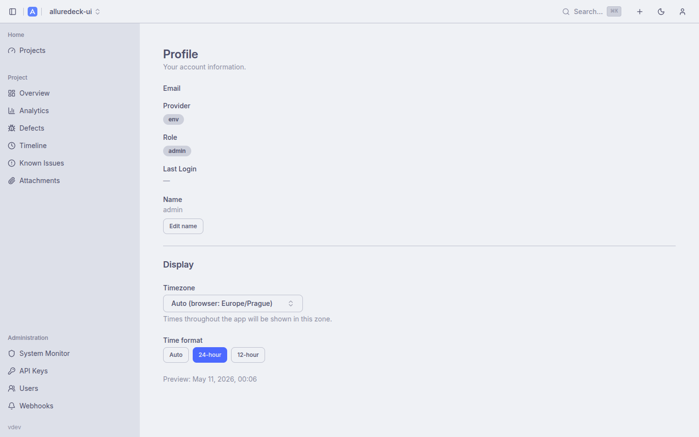

# User Management

AllureDeck includes a full user lifecycle system for local (password-based) and OIDC-provisioned accounts. Admins manage users from the Users page; each user can manage their own profile and preferences from the Profile page.

Related documentation: [Authentication](authentication.md) · [Security](security.md) · [Features](features.md)

---

## Table of Contents

1. [Roles](#roles)
2. [Admin User Management](#admin-user-management)
3. [User Lifecycle](#user-lifecycle)
4. [Self-Service Profile](#self-service-profile)
5. [Time and Timezone Preferences](#time-and-timezone-preferences)
6. [OIDC JIT Provisioning vs Admin-Created Users](#oidc-jit-provisioning-vs-admin-created-users)
7. [API Reference](#api-reference)

---

## Roles

Three roles control access across the application:

| Role | Level | Capabilities |
|------|-------|-------------|
| `admin` | 3 | Full access: create/delete projects, manage reports, manage users, system settings, API keys, webhooks |
| `editor` | 2 | Upload results, generate reports, manage known issues, create/edit webhooks, set default branches |
| `viewer` | 1 | Read-only: browse projects, view reports, view analytics, view known issues |

Roles are embedded in the JWT access token and re-checked on every request by the auth middleware.

---

## Admin User Management



Accessible at `/settings/users` (admin only). Non-admin users are redirected to their profile page.

**Features:**

- **Search** — substring match on email or display name (debounced, 300ms)
- **Role filter** — filter the list to admin / editor / viewer
- **Pagination** — 20 users per page; previous/next navigation

**Per-user actions (shown in the user row):**

| Action | Description |
|--------|-------------|
| **Change role** | Opens a confirmation dialog to set the user's role to admin, editor, or viewer |
| **Deactivate** | Soft-deletes the account — sets `is_active=false`, revokes all active sessions, and deletes all API keys for that user. Self-deactivation is blocked |
| **Reactivate** | Sets `is_active=true` for a previously deactivated account |
| **Reset password** | Admin-only. Generates a cryptographically random temporary password (24 URL-safe characters) and returns it once in a dialog. The user must change it on next login. All active sessions and API keys for the target are revoked immediately |

### Creating a user

Click **Invite user** to open the creation form. Required fields: email (must be a valid RFC 5322 address), display name, and role. The API generates a temporary password using 18 bytes of random entropy (24 base64 characters), hashes it with bcrypt (cost 12), and returns it once in the response. The temporary password is shown in a modal — copy it before closing, it is not stored and cannot be retrieved again.

```bash
# Create a user via API
curl -X POST https://alluredeck.example.com/api/v1/users \
  -H "Authorization: Bearer $ADMIN_TOKEN" \
  -H "Content-Type: application/json" \
  -d '{"email":"alice@example.com","name":"Alice","role":"editor"}'
```

Response (201):
```json
{
  "data": {
    "user": {
      "id": 12,
      "email": "alice@example.com",
      "name": "Alice",
      "provider": "local",
      "role": "editor",
      "is_active": true,
      "created_at": "2026-05-10T21:00:00.000Z"
    },
    "temp_password": "uX3kR9mQ2pLvNwJyZbAc7d"
  }
}
```

> The temporary password is shown exactly once. Share it via a secure channel.

---

## User Lifecycle

**Local accounts** (provider: `local`) are managed entirely within AllureDeck. Their lifecycle:

1. **Created** by admin with a temporary password
2. **Active** — can log in, access resources per their role
3. **Deactivated** (`is_active=false`) — cannot log in; all existing sessions revoked; all API keys deleted. The account record is retained
4. **Reactivated** — admin sets `is_active=true`; the user can log in again but must request a new temporary password if they don't remember theirs

> AllureDeck uses soft-delete (`is_active=false`) rather than hard-delete. This preserves the user's audit trail and prevents foreign-key issues in the audit log.

**Password requirements:** minimum 12 characters; new password must differ from the current one.

**Session revocation on sensitive operations:**

| Operation | Effect |
|-----------|--------|
| Self password change | All other active refresh-token families revoked; current access token JTI blacklisted |
| Admin password reset | All active sessions for the target user revoked; all API keys deleted |
| Account deactivation | All active sessions revoked; all API keys deleted |

---

## Self-Service Profile



Every authenticated user can access their profile at `/settings/profile`.

**Viewable fields:** email, provider (local / oidc / env), role badge, last login timestamp.

**Editable field:** display name (up to 120 characters). Click the edit button next to "Name", update, and save.

**Change password:** Available only for local accounts. Requires the current password for re-authentication. The form enforces the 12-character minimum. On success, all other active sessions are revoked and the current access token is blacklisted.

OIDC accounts and environment-configured accounts (`admin`/`viewer` env vars) cannot update their password through the UI — identity is managed externally.

---

## Time and Timezone Preferences

Users can configure how timestamps are displayed across the application. These preferences are stored in the user preferences blob (same JSONB column used for other UI preferences) and apply wherever AllureDeck formats dates and times.

**Settings (accessible from the Profile page):**

| Preference | Options | Description |
|------------|---------|-------------|
| **Timezone** | Any IANA timezone (e.g. `Europe/Berlin`, `America/New_York`) or Auto | When set to Auto, the browser's local timezone is used |
| **Time format** | Auto / 24h / 12h | Auto follows the browser/locale default; 24h and 12h force the respective format globally |

Changes take effect immediately without a page reload.

---

## OIDC JIT Provisioning vs Admin-Created Users

When OIDC SSO is enabled, users are provisioned Just-In-Time on first login:

- A new `users` row is created with `provider=oidc` and the role assigned by group mapping (see [Authentication](authentication.md))
- The user's email is their unique identifier; email uniqueness is enforced across providers — a `local` user and an OIDC user cannot share the same email address
- OIDC users cannot have their password changed via the UI; password reset is not available for `provider=oidc` accounts

Admin-created users (`provider=local`) co-exist with OIDC users. The Users page shows all users regardless of provider and supports filtering.

---

## API Reference

All user endpoints require `SECURITY_ENABLED=true`.

| Method | Path | Role | Description |
|--------|------|------|-------------|
| `GET` | `/api/v1/users` | admin | Paginated user list. Query params: `limit`, `offset`, `search`, `role`, `active` |
| `POST` | `/api/v1/users` | admin | Create a local user. Returns `temp_password` once |
| `GET` | `/api/v1/users/{id}` | admin | Get a user by ID |
| `PATCH` | `/api/v1/users/{id}` | admin | Update `role` and/or `active`. Body: `{"role":"editor"}` or `{"active":false}` |
| `DELETE` | `/api/v1/users/{id}` | admin | Deactivate (soft-delete) a user. Returns `204` |
| `POST` | `/api/v1/users/{id}/password` | admin | Reset another user's password. Returns new `temp_password` |
| `GET` | `/api/v1/users/me` | any | Get the authenticated user's own profile |
| `PATCH` | `/api/v1/users/me` | any | Update own display name. Body: `{"name":"Alice B."}` |
| `POST` | `/api/v1/users/me/password` | any (local only) | Change own password. Body: `{"current_password":"…","new_password":"…"}` |

Responses follow the standard envelope: `{"data": {...}, "metadata": {"message": "..."}}`.
