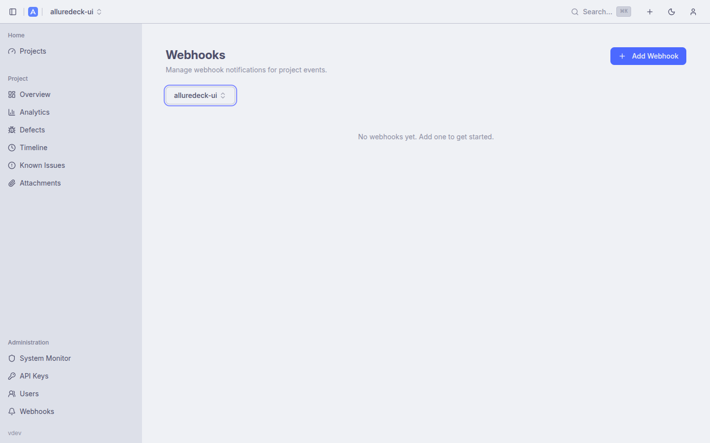
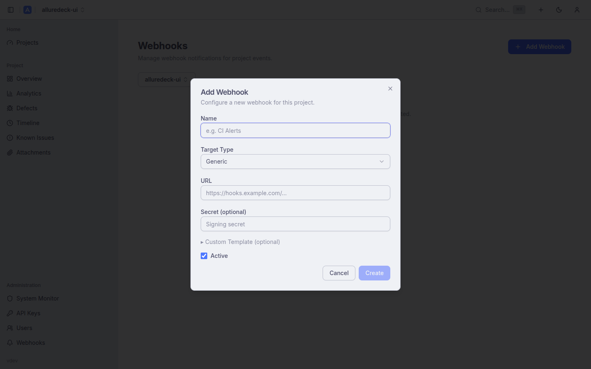

# Webhooks

Webhooks send outbound HTTP notifications when report generation finishes. Use them to post test results to Slack, Discord, Microsoft Teams, or any custom HTTPS endpoint.

Related documentation: [Features](features.md) · [Configuration Reference](configuration.md)

---

## Table of Contents

1. [Overview](#overview)
2. [Supported Targets](#supported-targets)
3. [Creating and Editing Webhooks](#creating-and-editing-webhooks)
4. [Payload Shape](#payload-shape)
5. [Target-Specific Examples](#target-specific-examples)
6. [Delivery and Retry](#delivery-and-retry)
7. [Security](#security)
8. [API Reference](#api-reference)

---

## Overview



Webhooks are managed at **Settings → Webhooks** (`/settings/webhooks`). The sidebar link is visible to editor and admin users only (viewers cannot manage webhooks).

Each webhook:
- Belongs to one project (selected via a project picker)
- Subscribes to one or more **events** (currently: `report_completed`)
- Has a **target type** that controls the payload format
- Can be toggled active/inactive without deleting it
- Is limited to **10 per project**

Webhook delivery is handled by a dedicated River worker queue (`webhooks` queue, 5 concurrent workers) to keep notification failures isolated from report generation.

---

## Supported Targets

| Target type | Description |
|-------------|-------------|
| `slack` | Slack Incoming Webhook URL — payload rendered as a Slack Block Kit message |
| `discord` | Discord channel webhook URL — payload rendered as a Discord embed |
| `teams` | Microsoft Teams Incoming Webhook URL — payload rendered as a Teams MessageCard |
| `generic` | Any HTTPS endpoint — receives a signed JSON payload |

---

## Creating and Editing Webhooks



Click **Add webhook** (or the edit icon on an existing webhook) to open the webhook form.

**Fields:**

| Field | Required | Description |
|-------|----------|-------------|
| **Name** | Yes | Display label (max 100 characters) |
| **Project** | Yes | Which project's report completions trigger this webhook |
| **Target type** | Yes | One of: `slack`, `discord`, `teams`, `generic` |
| **URL** | Yes | The webhook endpoint URL. Must use `http` or `https`. Private/loopback addresses are rejected (SSRF prevention) |
| **Secret** | No | (`generic` only) HMAC-SHA256 signing secret. When set, every delivery includes a `X-AllureDeck-Signature` header with the hex-encoded HMAC of the request body |
| **Custom template** | No | Override the default payload body with a custom template |
| **Events** | Yes | Which events trigger this webhook. Defaults to `["report_completed"]` |
| **Active** | — | Toggle — inactive webhooks receive no deliveries |

**Test delivery:** Each webhook row has a **Send test** action that queues a synthetic `report_completed` delivery with placeholder data. Use this to verify your endpoint is reachable before a real build.

---

## Payload Shape

All webhook deliveries send a JSON payload with the following top-level structure (exact rendering varies by target type — `slack`, `discord`, and `teams` targets render this as their respective message format; `generic` targets receive it directly).

**Generic JSON payload:**

```json
{
  "event": "report_completed",
  "project_id": 7,
  "build_number": 42,
  "timestamp": "2026-05-10T21:02:34Z",
  "dashboard_url": "https://alluredeck.example.com/projects/7/reports/42",
  "stats": {
    "total": 500,
    "passed": 480,
    "failed": 12,
    "broken": 3,
    "skipped": 5,
    "pass_rate": 96.0
  },
  "delta": {
    "pass_rate_change": 1.5,
    "new_failures": 2,
    "fixed_tests": 5
  },
  "ci": {
    "provider": "GitHub Actions",
    "build_url": "https://github.com/org/repo/actions/runs/123",
    "branch": "main",
    "commit_sha": "abc1234"
  }
}
```

`delta` is omitted when there is no previous build to compare against. `ci` is omitted when no CI metadata was provided on upload. `dashboard_url` is only populated when `EXTERNAL_URL` is configured.

---

## Target-Specific Examples

### Slack

Set `target_type: slack` and paste an [Incoming Webhook URL](https://api.slack.com/messaging/webhooks) from your Slack App configuration. AllureDeck renders a Block Kit message with pass rate, test counts, and a link to the report.

```bash
curl -X POST https://alluredeck.example.com/api/v1/projects/7/webhooks \
  -H "Authorization: Bearer $TOKEN" \
  -H "Content-Type: application/json" \
  -d '{
    "name": "Slack #test-results",
    "target_type": "slack",
    "url": "https://hooks.slack.com/services/T00/B00/xxxx",
    "events": ["report_completed"]
  }'
```

### Discord

Set `target_type: discord` and use a Discord channel webhook URL (Channel Settings → Integrations → Webhooks). AllureDeck renders a Discord embed with colour-coded pass rate.

```bash
curl -X POST https://alluredeck.example.com/api/v1/projects/7/webhooks \
  -H "Authorization: Bearer $TOKEN" \
  -H "Content-Type: application/json" \
  -d '{
    "name": "Discord #ci-reports",
    "target_type": "discord",
    "url": "https://discord.com/api/webhooks/1234/xxxx",
    "events": ["report_completed"]
  }'
```

### Microsoft Teams

Set `target_type: teams` and use an Incoming Webhook connector URL from a Teams channel. AllureDeck renders a MessageCard with an action button linking to the report.

```bash
curl -X POST https://alluredeck.example.com/api/v1/projects/7/webhooks \
  -H "Authorization: Bearer $TOKEN" \
  -H "Content-Type: application/json" \
  -d '{
    "name": "Teams - QA Notifications",
    "target_type": "teams",
    "url": "https://your-org.webhook.office.com/webhookb2/xxx",
    "events": ["report_completed"]
  }'
```

### Generic HTTP

Set `target_type: generic` to receive the raw JSON payload at any HTTPS endpoint. Optionally set a `secret` to enable HMAC-SHA256 request signing.

```bash
curl -X POST https://alluredeck.example.com/api/v1/projects/7/webhooks \
  -H "Authorization: Bearer $TOKEN" \
  -H "Content-Type: application/json" \
  -d '{
    "name": "My CI system",
    "target_type": "generic",
    "url": "https://ci.example.com/hooks/alluredeck",
    "secret": "my-signing-secret",
    "events": ["report_completed"]
  }'
```

When a secret is set, each delivery includes:

```
X-AllureDeck-Signature: sha256=<hex-encoded HMAC-SHA256 of body>
```

Verify on your server:

```python
import hmac, hashlib
expected = hmac.new(b"my-signing-secret", body, hashlib.sha256).hexdigest()
assert hmac.compare_digest(f"sha256={expected}", request.headers["X-AllureDeck-Signature"])
```

---

## Delivery and Retry

Deliveries are attempted up to **5 times** with exponential backoff. Each attempt is recorded in the delivery log.

**View delivery history:** Click the history icon on a webhook row. Each entry shows:
- HTTP status code
- Response body (truncated)
- Error message (on failure)
- Attempt number
- Duration in milliseconds
- Delivery timestamp

Entries are ordered newest first and paginated (20 per page).

---

## Security

- **URLs are masked** in API responses: `https://hooks.slack.com/****`. The full URL is never returned after creation.
- **Secrets are never returned** from the API. The `has_secret` boolean indicates whether a secret is set.
- **URLs are stored encrypted** at rest using AES-GCM.
- **SSRF prevention:** The server validates webhook URLs before saving. Private IP ranges (RFC 1918), loopback addresses (`127.0.0.1`, `::1`, `localhost`), and link-local addresses are rejected.
- **Access control:** Creating, editing, and deleting webhooks requires editor or admin role. The sidebar link to the Webhooks page is hidden from viewer accounts.

---

## API Reference

All webhook endpoints require editor or admin role.

| Method | Path | Description |
|--------|------|-------------|
| `GET` | `/api/v1/projects/{project_id}/webhooks` | List all webhooks for a project |
| `POST` | `/api/v1/projects/{project_id}/webhooks` | Create a webhook (max 10 per project) |
| `GET` | `/api/v1/projects/{project_id}/webhooks/{webhook_id}` | Get a single webhook (URL masked) |
| `PUT` | `/api/v1/projects/{project_id}/webhooks/{webhook_id}` | Update a webhook (partial update — omit fields to leave unchanged) |
| `DELETE` | `/api/v1/projects/{project_id}/webhooks/{webhook_id}` | Delete a webhook |
| `POST` | `/api/v1/projects/{project_id}/webhooks/{webhook_id}/test` | Queue a test delivery |
| `GET` | `/api/v1/projects/{project_id}/webhooks/{webhook_id}/deliveries` | Paginated delivery history. Query params: `page`, `per_page` |
